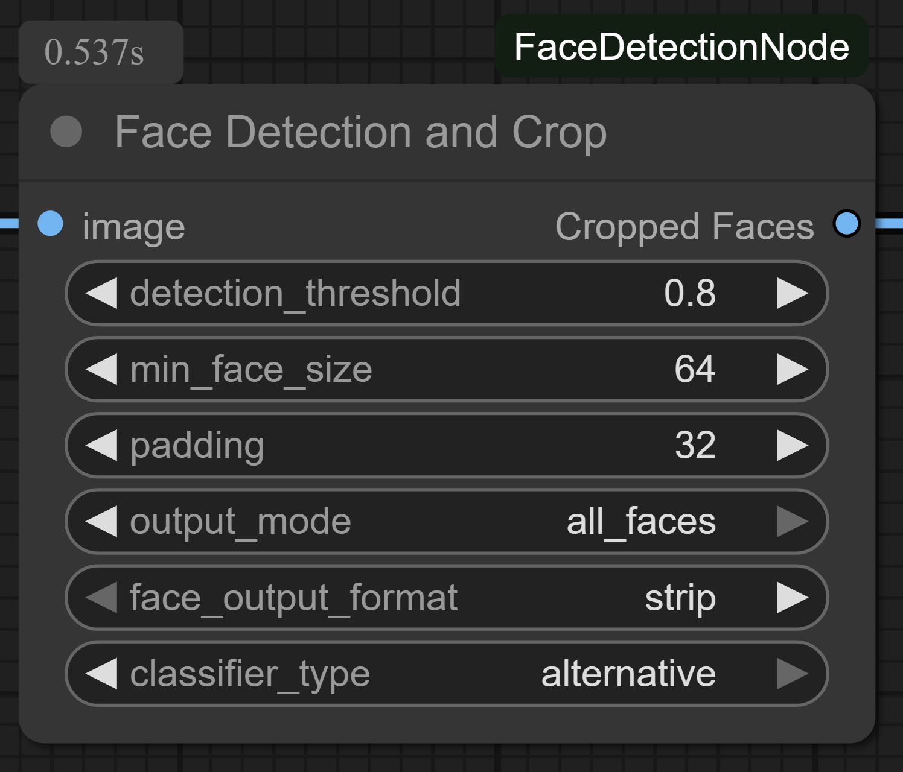

# ComfyUI Face Detection Node

A ComfyUI custom node for face detection and cropping using OpenCV Haar cascades — optimized for H100 cloud pipelines and LTX-Video avatar workflows. Full ComfyUI v3 schema support with backward compatibility for v1/v2.




## Features

- **Auto-Padding**: Adaptive padding based on detected face size (no hardcoded values)
- **Temporal Smoothing**: Exponential moving average of bbox coordinates across video frames — eliminates jitter in batch/video processing
- **Aspect Ratio Presets**: `1:1`, `9:16`, `16:9`, `4:3`, `auto` — with forced crop recalculation
- **Full Batch Processing**: Iterates all batch items, outputs aligned batch tensors
- **GPU-First**: `torch.no_grad()` everywhere, minimal CPU transfers, stateless class-level caching
- **Face Output Format**: `strip` (horizontal layout) or `individual` (separate batch items) for multi-face output
- **Dual Classifiers**: Choose between default and alternative Haar cascades
- **Proper Error Signaling**: Returns flagged tensor + metadata when no face detected
- **ComfyUI v3 Ready**: Full schema support with async execution
- **Legacy Workflow Compat**: Handles old v1.x workflows with positional `widgets_values` misalignment gracefully

## Installation

### Via ComfyUI Manager (Recommended)
1. Open ComfyUI Manager
2. Search for "Face Detection Node"
3. Click Install

### Manual Installation
1. Navigate to your ComfyUI custom nodes directory:
   ```bash
   cd ComfyUI/custom_nodes
   git clone https://github.com/Limbicnation/ComfyUI_FaceDetectionNode.git
   cd ComfyUI_FaceDetectionNode
   pip install -r requirements.txt
   ```

## Usage

1. Add the **"Face Detection and Crop v2"** node to your workflow
2. Connect an image batch input
3. Adjust parameters as needed

### Parameters

| Parameter | Type | Range | Default | Description |
|-----------|------|-------|---------|-------------|
| detection_threshold | Float | 0.1–1.0 | 0.8 | Face detection confidence threshold (0.1=lenient, 1.0=strict) |
| min_face_size | Int | 32–512 | 64 | Minimum face dimension in pixels |
| auto_padding_ratio | Int | 0–100 | 35 | Padding as percentage of detected face size |
| aspect_ratio | Combo | — | auto | Crop aspect ratio: `auto`, `1:1`, `9:16`, `16:9`, `4:3` |
| output_mode | Combo | — | largest_face | `largest_face` or `all_faces` |
| temporal_smoothing | Int | 0–100 | 0 | 0=disabled (image mode) · 1–100=EMA smoothing strength for video |
| output_height | Int | 256–2048 | 512 | Output height for cropped faces (width derived from aspect ratio) |
| instance_id | String | — | "0" | Unique ID for temporal smoothing (share across frames). Use "0" for image mode |
| classifier_type | Combo | — | default | Haar cascade: `default` or `alternative` |
| face_output_format | Combo | — | strip | `strip` (horizontal) or `individual` (separate batch items) |
| padding | Int | 0–256 | 0 | Legacy padding in pixels — if >0, overrides `auto_padding_ratio` |

### Outputs

| Output | Type | Description |
|--------|------|-------------|
| cropped_faces | IMAGE | Batch of cropped face tensors `[B, H, W, C]` |
| face_metadata | FLOAT | Per-face metadata `[x, y, w, h, score, detected]` normalized to image dims. Shape: `[B, 6]` — NOT an image, use for downstream bbox logic only |

### Temporal Smoothing for Video

When processing video frames through ComfyUI, face detection bboxes can jitter frame-to-frame. Enable temporal smoothing to stabilize:

- Set `temporal_smoothing` to 1–100 (higher = more smoothing)
- Use a consistent `instance_id` across all frames in the same video sequence
- Set to `"0"` for single-image mode (no smoothing)

## Changelog

### v2.1.2
- **FIX**: `instance_id` input type changed from INT to STRING. Legacy workflows pass `instance_id="default"` (string) from old v1 nodes — ComfyUI's `validate_inputs` runs before `execute()`, so `_coerce_int` never fires. Since `instance_id` is only a dict key, STRING is the correct type.

### v2.1.1
- **FIX**: `temporal_smoothing` input validation error — moved to optional section in `INPUT_TYPES` to prevent ComfyUI framework-level `int()` coercion crash when legacy workflows pass string `"default"` (from `classifier_type`) into this slot via positional `widgets_values` mapping
- **FIX**: Added `_coerce_int()` helper for safe string→int conversion with fallback to defaults, applied defensively in both v1 and v3 execute methods
- **FIX**: Enhanced `VALIDATE_INPUTS` to handle type mismatches gracefully (was only handling `face_output_format` before)

### v2.1.0
- **BACKWARD-COMPAT**: Re-added optional `face_output_format` param (`strip`/`individual`) — old workflows now work; invalid values auto-fallback with warning
- **BACKWARD-COMPAT**: Re-added optional `padding` param — auto-converts to `auto_padding_ratio`
- **FIX**: `all_faces` mode now actually detects ALL faces (not just largest)
- **FIX**: `OUTPUT_NODE=True` on v3 schema
- **FIX**: `VALIDATE_INPUTS` on v1 wrapper to catch invalid combo values early

### v2.0.0
- Auto-Padding, Temporal Smoothing, Aspect Ratio Presets, Full Batch Processing, GPU-First, Proper Error Signaling

## Compatibility

- **ComfyUI v3**: Full schema support with async execution (`DEFINE_SCHEMA`)
- **ComfyUI v1/v2**: Backward compatibility via `FaceDetectionNodeV1` wrapper class
- **Auto-detection**: Automatically selects appropriate implementation based on available ComfyUI API

## Requirements

- Python ≥ 3.10
- OpenCV ≥ 4.5.0
- PyTorch ≥ 2.0.0
- NumPy ≥ 1.21.0

## License

Apache License Version 2.0, January 2004 — see [LICENSE](LICENSE) file for details.
